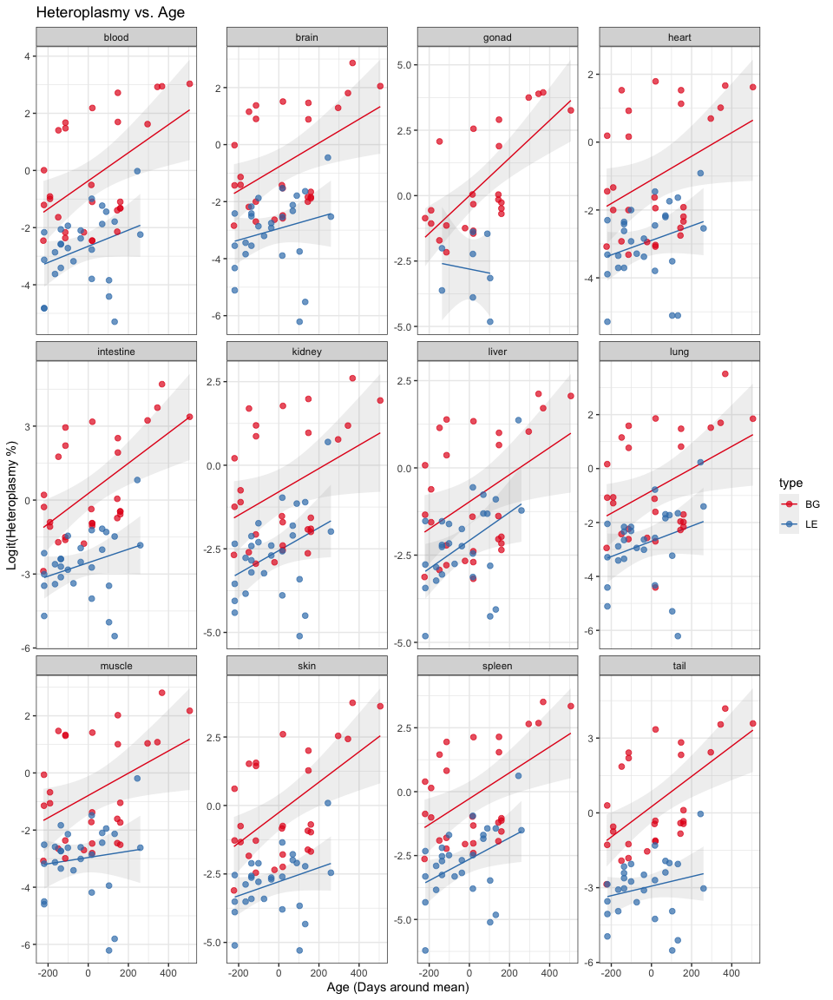
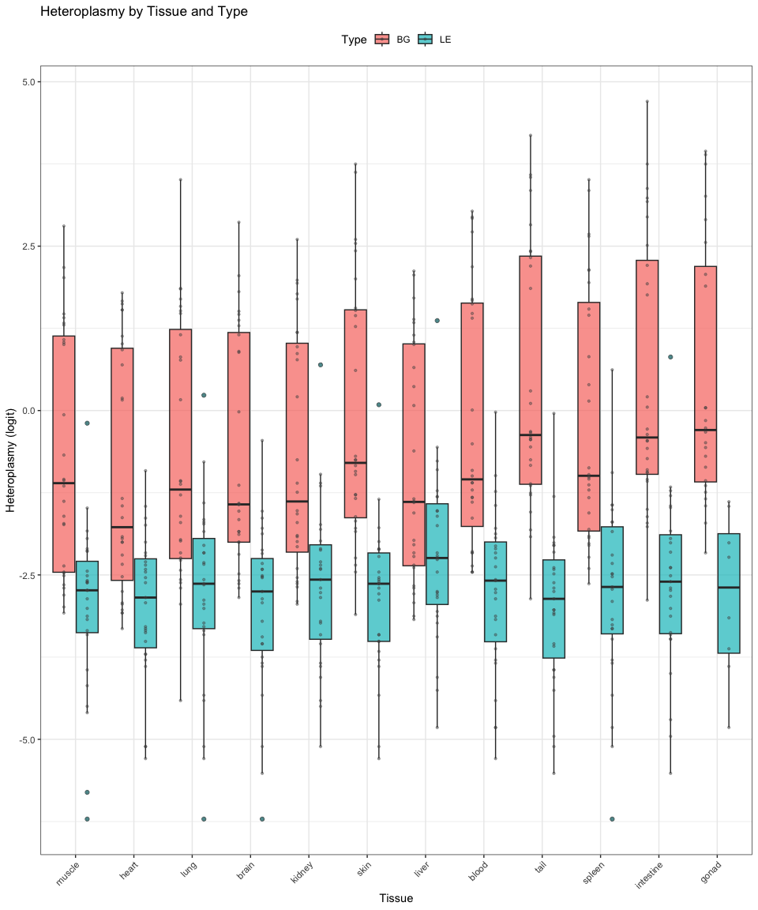
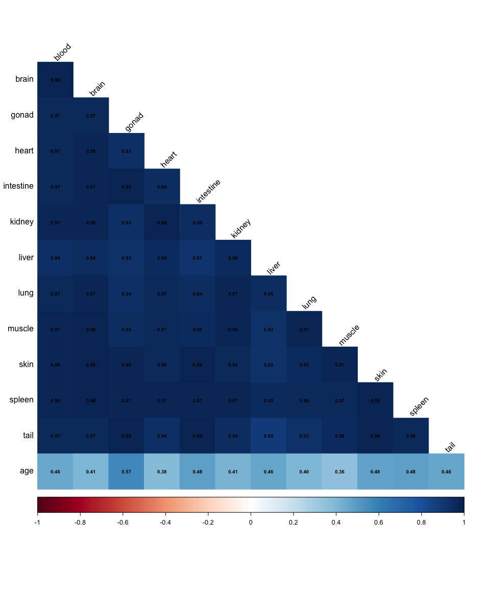
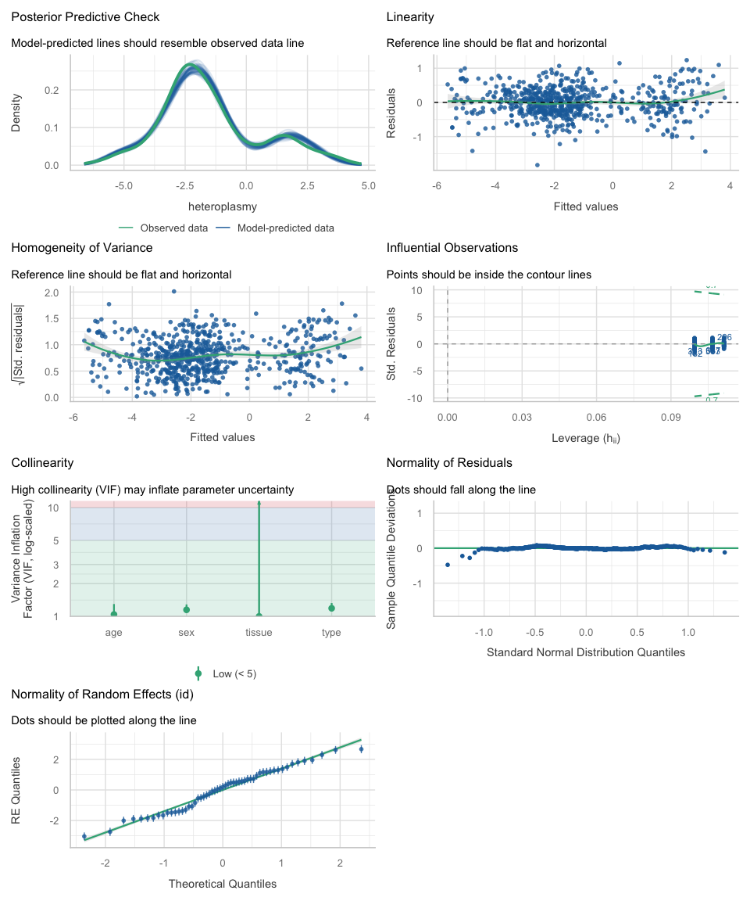
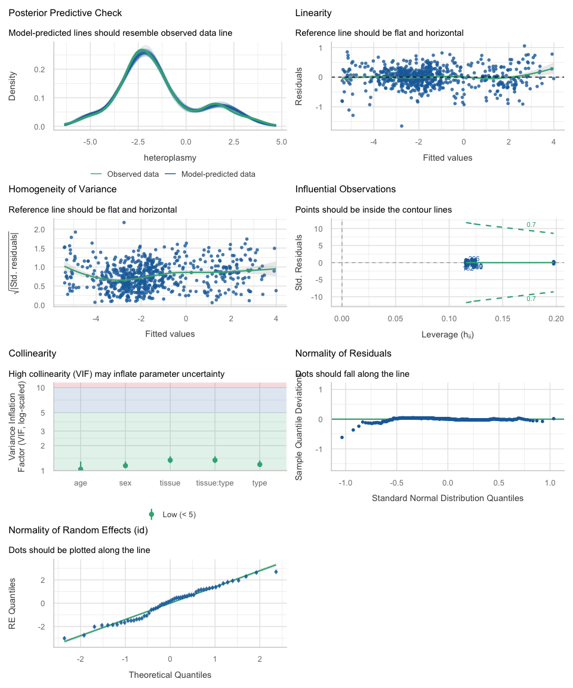
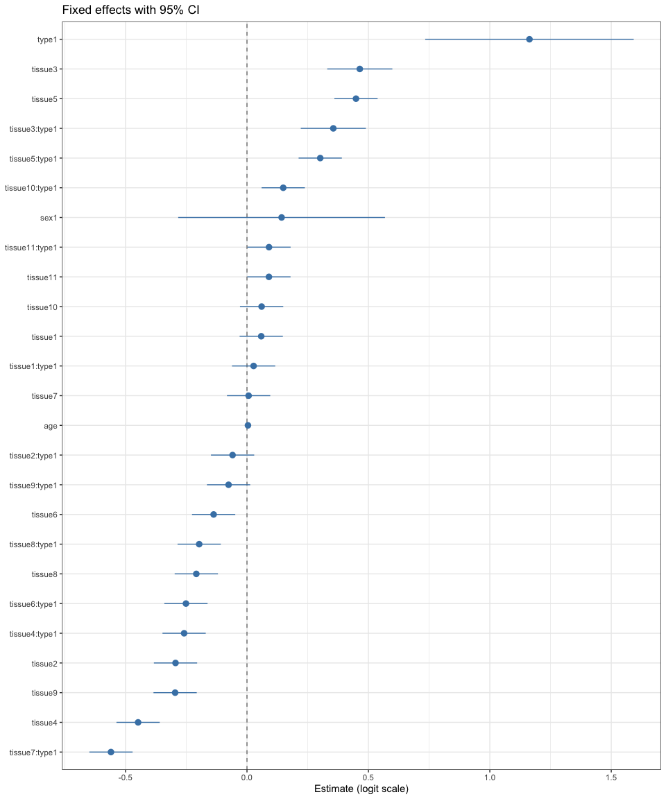
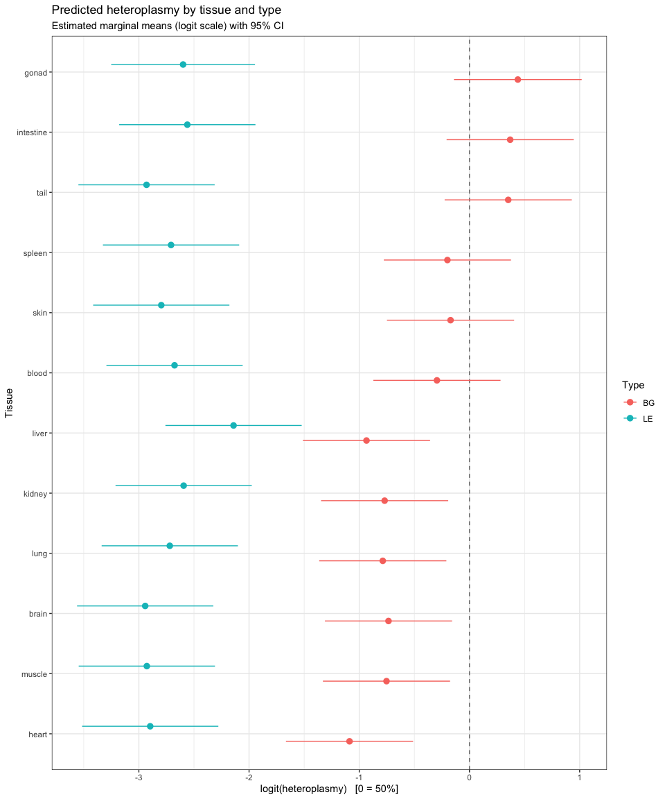

# Modeling heteroplasmy in mice.
Are Olsen
2026-10-03

## Introduction.

Heteroplasmy refers to the coexistence of different mitochondrial DNA
(mtDNA) variants within the same cell or organism. Its level can vary
between tissues and may change over time as mitochondrial populations
undergo replication, segregation, and selection. Understanding these
patterns is therefore important for characterizing how mtDNA variation
is maintained and distributed across an organism.

In this analysis, we model heteroplasmy in mice to investigate how it
varies across different tissues, mouse types, age, and sex. Because
heteroplasmy is measured as a percentage and is bounded between 0 and
100%, the measurements are transformed using a clamped logit
transformation prior to modeling. Linear mixed-effects models are then
used to account for both fixed effects, such as tissue, age, type, and
sex, and repeated measurements from the same mouse. Different model
specifications are compared to identify which combination of factors
best describes the observed variation in heteroplasmy.

## Importing libraries, defining functions.

<details class="code-fold">
<summary>Code</summary>

``` r
library(dplyr)
library(tidyr)
library(lme4)
library(lmerTest)
library(performance)
library(ggplot2)
library(see)
library(corrplot)
library(broom.mixed)
library(emmeans)
options(na.action = "na.omit")
options(contrasts = c("contr.sum", "contr.poly")) # Sum coding is more fitting here.
```

</details>

``` r
logit <- function(x) {
  p <- x / 100
  p <- ifelse(p <= 0, 0.0001, ifelse(p >= 1, 0.9999, p))
  return(log(p / (1 - p)))
}
```

## Loading the data.

``` r
#Load in data.
df <- read.csv("mouse-mtdna.csv", stringsAsFactors = FALSE)

# Apply logit to all tissue columns.
metadata_cols <- c("index", "type", "id", "sex", "age")
df <- mutate(df, across(-all_of(metadata_cols), logit))
```

``` r
head(df,5)
```

      index type    id sex age    tail.21       brain      heart      muscle
    1     7   BG BG144   F  33 -2.6021528 -2.84385174 -3.0785683 -3.07856828
    2     8   BG BG150   F  36  0.5971325 -0.02000067  0.1885567 -0.06402186
    3     9   BG BG154   M  36 -1.1636759 -1.43063348 -1.4500102 -1.14720484
    4    10   BG  BG72   M  66 -0.5279292 -1.41148461 -1.3370233 -0.67669206
    5    11   BG  BG73   M  66 -0.8616248 -1.13630181 -2.0019341 -1.06161996
          kidney       liver       lung        blood  intestine       skin
    1 -2.6827324 -3.12717816 -2.9444390 -2.456012184 -2.8830072 -3.1026033
    2  0.2087548  0.07603661  0.1643691  0.008000043  0.2087548  0.6102595
    3 -1.2425065 -1.34310443 -1.0773913 -1.208311206 -0.2818512 -1.2773597
    4 -0.7491800 -0.61464649 -1.0668636 -0.909999205 -0.9002457 -0.7537718
    5 -1.1039528 -1.55753947 -1.2832353 -0.994622575 -1.0773913 -1.3370233
          spleen       tail     testis uterus
    1 -2.6337126 -2.8632585         NA     NA
    2  0.3929806  0.2981901         NA     NA
    3 -0.8712224 -1.2832353 -0.8616248     NA
    4  0.1442496 -0.7491800 -0.5623668     NA
    5 -1.0098970 -0.5537276 -1.0668636     NA

Quick test to verify that there is atleast some heteroplasmy change
spotted, here in tail. Checking assumtpion about normality in tail
difference distribution.

``` r
shapiro.test(df$tail-df$tail.21) 
```

        Shapiro-Wilk normality test

    data:  df$tail - df$tail.21
    W = 0.94785, p-value = 0.0185

Since failed, we resort to the non-parametric alternative.

``` r
wilcox.test(df$tail,df$tail.21,paired=TRUE)
```

        Wilcoxon signed rank test with continuity correction

    data:  df$tail and df$tail.21
    V = 1171, p-value = 5.625e-05
    alternative hypothesis: true location shift is not equal to 0

## Preparing the data.

With the initial check done, the data is reshaped for modelling. The
snapshot column is dropped, sex-specific gonad tissues are pooled, the
table is pivoted to long format, and age is centred. This leaves one row
per mouse and tissue.

``` r
# Drop the tail.21 data since it's a snapshot, and not time-dependent.
df <- select(df, -tail.21)

# Pool sex specific features.
df <- df %>%
  mutate(
    gonad = coalesce(testis, uterus)   # picks whichever is non-NA
  ) %>%
  select(-testis, -uterus)

# Pivot tissue data.
df <- pivot_longer(
    df,
    cols = -all_of(metadata_cols),
    names_to = "tissue",
    values_to = "heteroplasmy"
  )

# Make qualitative factors / categorical data into binary factors.
df <- df %>%
  mutate(across(c(tissue, type, id, sex), as.factor)) %>%
  as.data.frame()

# Center around age.
df <- mutate(df,age = age-mean(age,na.rm=TRUE))

#Remove NA heteroplasmies.
df <- df %>% filter(!is.na(heteroplasmy))
```

## Simple Exploratory Data Analysis.

Before fitting anything, we look at the data. The plots below show how
heteroplasmy relates to age, how it differs between tissues and types,
and how strongly tissues co-vary within an animal.

### Heteroplasmy over time.

First, heteroplasmy against age, with a separate trend line for each
type within each tissue. This shows whether heteroplasmy drifts with age
and whether the drift is similar across tissues.

``` r
ggplot(df, aes(x = age, y = heteroplasmy, color = type)) +
  #Trend lines.
  geom_smooth(method = "lm", se = TRUE, linewidth = 0.5, alpha = 0.15) +
  #Points.
  geom_point(alpha = 0.7, size = 2) +
  facet_wrap(~tissue, scales = "free_y", axes = "margins", axis.labels = "all_x") + 
  scale_color_brewer(palette = "Set1") +
  theme_bw() +
  labs(
    title = "Heteroplasmy vs. Age",
    x = "Age (Days around mean)",
    y = "Logit(Heteroplasmy %)"
  )
```

    `geom_smooth()` using formula = 'y ~ x'



### Boxplot for heteroplasmy versus tissue and type.

Next, the distribution per tissue, split by type and ordered by median.
This shows which tissues sit higher or lower and whether the type
difference is consistent between them.

``` r
df %>%
  ggplot(aes(x = reorder(tissue, heteroplasmy, FUN = median), 
             y = heteroplasmy, 
             fill = type)) +
  geom_boxplot(
    outlier.shape = 21, 
    outlier.size = 1.5, 
    alpha = 0.7, 
    position = position_dodge(width = 0.8)
  ) +
  geom_jitter(
    aes(group = type),
    position = position_dodge(width = 0.8),
    size = 0.8, 
    alpha = 0.4, 
    colour = "grey30"
  ) +
  labs(
    title = "Heteroplasmy by Tissue and Type",
    x = "Tissue",
    y = "Heteroplasmy (logit)",
    fill = "Type"
  ) +
  theme_bw() +
  theme(
    legend.position = "top",
    axis.text.x = element_text(angle = 45, hjust = 1),
    plot.title = element_text(size = 13)
  )
```



### Pearson’s sampple linear correlation matrix.

Finally, the correlation between tissues across animals. High
correlations would mean that an animal’s heteroplasmy level is largely
shared across its tissues. That would justify the per-mouse random
intercept used in the models.

``` r
cor_data <- df %>%
  group_by(id, tissue) %>%
  summarise(heteroplasmy = mean(heteroplasmy, na.rm = TRUE), .groups = "drop") %>%
  pivot_wider(names_from = tissue, values_from = heteroplasmy) %>%
  left_join(
    df %>% group_by(id) %>% summarise(age = mean(age, na.rm = TRUE), .groups = "drop"),
    by = "id"
  ) %>%
  select(-id)

cor_matrix <- cor(cor_data, use = "pairwise.complete.obs")

corrplot(cor_matrix,
         method = "color",
         type = "lower",
         tl.col = "black",
         tl.srt = 45,
         addCoef.col = "black",
         number.cex = 0.6,
         diag = FALSE)
```



## Training different linear models.

Train a multitude of different linear models.

We start with a simple additive baseline: tissue, type, age and sex as
fixed effects, plus a random intercept for each mouse. We check its fit
and assumptions before trying richer structures.

``` r
# Base model.
m_base = lmer(heteroplasmy ~ tissue + type + age + sex + (1 | id), data = df)
performance(m_base)
```

    # Indices of model performance

    AIC    |   AICc |    BIC | R2 (cond.) | R2 (marg.) |   ICC |  RMSE | Sigma
    --------------------------------------------------------------------------
    1140.7 | 1141.7 | 1216.4 |      0.954 |      0.478 | 0.911 | 0.429 | 0.453

The baseline fits well, with a conditional R² of 0.95, but the fixed
effects alone explain about half of the variance (marginal R² 0.50).
Most of the rest is between-mouse variation, with an ICC of 0.91. Next,
the diagnostics for the baseline.

``` r
check_model(m_base)
```



``` r
check_heteroscedasticity(m_base)
```

    OK: Error variance appears to be homoscedastic (p = 0.717).

``` r
shapiro.test(residuals(m_base))
```

        Shapiro-Wilk normality test

    data:  residuals(m_base)
    W = 0.99258, p-value = 0.002938

``` r
check_singularity(m_base)
```

    [1] FALSE

``` r
check_collinearity(m_base)
```

    # Check for Multicollinearity

    Low Correlation

       Term  VIF       VIF 95% CI adj. VIF Tolerance Tolerance 95% CI
     tissue 1.00 [1.00,      Inf]     1.00      1.00     [0.00, 1.00]
       type 1.19 [1.11,     1.33]     1.09      0.84     [0.75, 0.90]
        age 1.04 [1.01,     1.30]     1.02      0.96     [0.77, 0.99]
        sex 1.15 [1.08,     1.29]     1.07      0.87     [0.78, 0.93]

``` r
outliers <- check_outliers(m_base, method = "cook")
print(outliers)
```

    OK: No outliers detected.
    - Based on the following method and threshold: cook (0.7).
    - For variable: (Whole model)

Variance is homoscedastic and there are no influential outliers.
Collinearity is low. The residuals deviate slightly from normality
(Shapiro-Wilk p = 0.003), but with over 600 observations and a mixed
model that is a mild concern. Since the baseline is adequate, we compare
it against models with interaction terms, fitted by maximum likelihood
so the likelihoods are comparable.

### Automated Model Selection.

We compare the baseline against four models with interaction terms, so
the likelihoods are comparable. The baseline diagnostics were acceptable
(homoscedastic, no influential outliers, low collinearity, only mildly
non-normal residuals), so we test whether richer structures improve it.
With REML=FALSE for accurate model likelihood comparisons.

``` r
models <- list(
  m_base        = lmer(heteroplasmy ~ tissue + type + age + sex + (1 | id), data = df, REML = FALSE),
  m_type_age    = lmer(heteroplasmy ~ tissue + type * age + sex + (1 | id), data = df, REML = FALSE),
  m_tissue_age  = lmer(heteroplasmy ~ tissue * age + type + sex + (1 | id), data = df, REML = FALSE),
  m_tissue_type = lmer(heteroplasmy ~ tissue * type + age + sex + (1 | id), data = df, REML = FALSE),
  m_dual_2way   = lmer(heteroplasmy ~ tissue * type + type * age + sex + (1 | id), data = df, REML = FALSE)
)

comp_results <- compare_performance(models, rank = TRUE)
print(comp_results)
```

    # Comparison of Model Performance Indices

    Name          |           Model | R2 (cond.) | R2 (marg.) |   ICC |  RMSE
    -------------------------------------------------------------------------
    m_tissue_type | lmerModLmerTest |      0.972 |      0.514 | 0.943 | 0.328
    m_dual_2way   | lmerModLmerTest |      0.973 |      0.522 | 0.943 | 0.328
    m_tissue_age  | lmerModLmerTest |      0.959 |      0.502 | 0.918 | 0.398
    m_type_age    | lmerModLmerTest |      0.953 |      0.503 | 0.905 | 0.429
    m_base        | lmerModLmerTest |      0.953 |      0.495 | 0.906 | 0.429

    Name          | Sigma | AIC weights | AICc weights | BIC weights | Performance-Score
    ------------------------------------------------------------------------------------
    m_tissue_type | 0.343 |       0.649 |        0.671 |       0.945 |            96.31%
    m_dual_2way   | 0.343 |       0.351 |        0.329 |       0.055 |            75.88%
    m_tissue_age  | 0.417 |    2.70e-50 |     2.79e-50 |    3.93e-50 |            19.23%
    m_type_age    | 0.449 |    9.75e-65 |     2.20e-64 |    6.76e-55 |             3.81%
    m_base        | 0.449 |    1.78e-64 |     4.26e-64 |    1.14e-53 |             0.41%

The tissue × type interaction model ranks first, with a performance
score of about 96% and nearly all of the BIC weight. Adding the age
interactions does not help, so we keep the tissue × type model.

``` r
# Get best model and reupdate with REML=TRUE to allow uncertaincy in fixed effects.
best_model_id <- comp_results$Name[1]
cat("\nSelected Top Model:", best_model_id, "\n\n")
```

    Selected Top Model: m_tissue_type 

``` r
final_model_ml  <- models[[best_model_id]]
final_model     <- update(final_model_ml, REML = TRUE)
```

The winner is refitted with REML to get unbiased variance components and
standard errors. Because sum coding is used, coefficients are deviations
from the grand mean, not from a reference level.

``` r
# Best model performance.
summary(final_model)
```

    Linear mixed model fit by REML. t-tests use Satterthwaite's method [
    lmerModLmerTest]
    Formula: heteroplasmy ~ tissue * type + age + sex + (1 | id)
       Data: df

    REML criterion at convergence: 846.7

    Scaled residuals: 
        Min      1Q  Median      3Q     Max 
    -4.7238 -0.5322  0.0298  0.5642  3.0176 

    Random effects:
     Groups   Name        Variance Std.Dev.
     id       (Intercept) 2.107    1.4514  
     Residual             0.122    0.3493  
    Number of obs: 637, groups:  id, 55

    Fixed effects:
                     Estimate Std. Error         df t value Pr(>|t|)    
    (Intercept)     -1.554330   0.198312  51.043964  -7.838 2.59e-10 ***
    tissue1          0.058708   0.045340 560.008797   1.295  0.19591    
    tissue2         -0.294270   0.045340 560.008797  -6.490 1.89e-10 ***
    tissue3          0.464523   0.068254 560.260732   6.806 2.59e-11 ***
    tissue4         -0.448361   0.045340 560.008797  -9.889  < 2e-16 ***
    tissue5          0.448894   0.045340 560.008797   9.901  < 2e-16 ***
    tissue6         -0.137319   0.045340 560.008797  -3.029  0.00257 ** 
    tissue7          0.006769   0.045340 560.008797   0.149  0.88137    
    tissue8         -0.208693   0.045340 560.008797  -4.603 5.16e-06 ***
    tissue9         -0.295914   0.045340 560.008797  -6.527 1.51e-10 ***
    tissue10         0.060261   0.045340 560.008797   1.329  0.18436    
    tissue11         0.090363   0.045340 560.008797   1.993  0.04674 *  
    type1            1.163212   0.213836  51.047078   5.440 1.52e-06 ***
    age              0.003986   0.001163  51.003851   3.426  0.00122 ** 
    sex1             0.142564   0.212040  51.009900   0.672  0.50440    
    tissue1:type1    0.027305   0.045340 560.008672   0.602  0.54727    
    tissue2:type1   -0.059299   0.045340 560.008672  -1.308  0.19145    
    tissue3:type1    0.355507   0.068254 560.254060   5.209 2.68e-07 ***
    tissue4:type1   -0.258872   0.045340 560.008672  -5.710 1.84e-08 ***
    tissue5:type1    0.301647   0.045340 560.008672   6.653 6.84e-11 ***
    tissue6:type1   -0.251333   0.045340 560.008672  -5.543 4.58e-08 ***
    tissue7:type1   -0.560083   0.045340 560.008672 -12.353  < 2e-16 ***
    tissue8:type1   -0.196826   0.045340 560.008672  -4.341 1.68e-05 ***
    tissue9:type1   -0.075805   0.045340 560.008672  -1.672  0.09509 .  
    tissue10:type1   0.149250   0.045340 560.008672   3.292  0.00106 ** 
    tissue11:type1   0.090665   0.045340 560.008672   2.000  0.04602 *  
    ---
    Signif. codes:  0 '***' 0.001 '**' 0.01 '*' 0.05 '.' 0.1 ' ' 1

    Correlation matrix not shown by default, as p = 26 > 12.
    Use print(x, correlation=TRUE)  or
        vcov(x)        if you need it

Type has a strong main effect, and age has a small positive effect. Sex
is not significant. Several tissue × type terms are significant, so the
type difference varies between tissues.

``` r
performance(final_model)
```

    # Indices of model performance

    AIC   |  AICc |    BIC | R2 (cond.) | R2 (marg.) |   ICC |  RMSE | Sigma
    ------------------------------------------------------------------------
    902.7 | 905.3 | 1027.5 |      0.972 |      0.496 | 0.945 | 0.328 | 0.349

The model has a conditional R² of 0.97 and an ICC of 0.95, so most of
the variance is between mice. The fixed effects alone explain about half
(marginal R² 0.50). Next, the assumption checks.

``` r
check_model(final_model)
```



``` r
check_heteroscedasticity(final_model)
```

    OK: Error variance appears to be homoscedastic (p = 0.801).

``` r
shapiro.test(residuals(final_model))
```

        Shapiro-Wilk normality test

    data:  residuals(final_model)
    W = 0.98363, p-value = 1.459e-06

``` r
check_singularity(final_model)
```

    [1] FALSE

``` r
check_collinearity(final_model)
```

    # Check for Multicollinearity

    Low Correlation

            Term  VIF   VIF 95% CI adj. VIF Tolerance Tolerance 95% CI
          tissue 1.34 [1.23, 1.49]     1.16      0.75     [0.67, 0.81]
            type 1.19 [1.11, 1.32]     1.09      0.84     [0.76, 0.90]
             age 1.04 [1.01, 1.29]     1.02      0.96     [0.78, 0.99]
             sex 1.15 [1.08, 1.28]     1.07      0.87     [0.78, 0.93]
     tissue:type 1.34 [1.23, 1.49]     1.16      0.75     [0.67, 0.81]

``` r
outliers <- check_outliers(final_model, method = "cook")
print(outliers)
```

    OK: No outliers detected.
    - Based on the following method and threshold: cook (0.7).
    - For variable: (Whole model)

Variance is homoscedastic, there is no singularity, collinearity is low,
and no influential outliers were found. The residuals are slightly
non-normal (Shapiro-Wilk p \< 0.001), which is a mild concern with over
600 observations. The model is adequate for interpretation. \###
Extracting information from best model fit.

To finish, we visualise the model. The forest plot shows the
fixed-effect estimates with 95% confidence intervals. The estimated
marginal means show predicted heteroplasmy per tissue and type, on the
logit scale where 0 corresponds to 50%.

``` r
#Forest plot with 95%CI.
tidy(final_model, effects = "fixed", conf.int = TRUE) %>%
  filter(term != "(Intercept)") %>%
  ggplot(aes(x = estimate, y = reorder(term, estimate),
             xmin = conf.low, xmax = conf.high)) +
  geom_vline(xintercept = 0, linetype = 2, color = "grey50") +
  geom_pointrange(color = "steelblue") +
  theme_bw() +
  labs(x = "Estimate (logit scale)", y = NULL,
       title = "Fixed effects with 95% CI")
```



``` r
#Emmeans plot with 95%CI.
emm <- emmeans(final_model, ~tissue | type)
ggplot(as.data.frame((emm)), aes(x = emmean,
                   y = reorder(tissue, emmean),
                   xmin = lower.CL,
                   xmax = upper.CL, 
                   color = type)) +
  geom_vline(xintercept = 0, linetype = 2, color = "grey50") +
  geom_pointrange(position = position_dodge(width = 0.5),
                  size = 0.5) +
  theme_bw() +
  labs(
    title = "Predicted heteroplasmy by tissue and type",
    subtitle = "Estimated marginal means (logit scale) with 95% CI",
    x = "logit(heteroplasmy)   [0 = 50%]",
    y = "Tissue",
    color = "Type"
  )
```



### Conclusion.

Heteroplasmy in these mice depends mainly on tissue and type, and the
effect of type differs between tissues. The best model included a tissue
× type interaction. Age had a small but significant positive effect,
about 0.004 logit units per day, and sex had no detectable effect. Most
of the variance is between individual mice (ICC ≈ 0.95), so which animal
a sample came from matters a lot. Residuals are homoscedastic with no
influential outliers, but slightly non-normal, so p-values near the
threshold should be read with some caution. The age effect is small and
assumed to be linear and shared across tissues. Adding age interactions
did not improve the fit. With more animals or a longer follow-up,
tissue-specific ageing trends could be tested.
